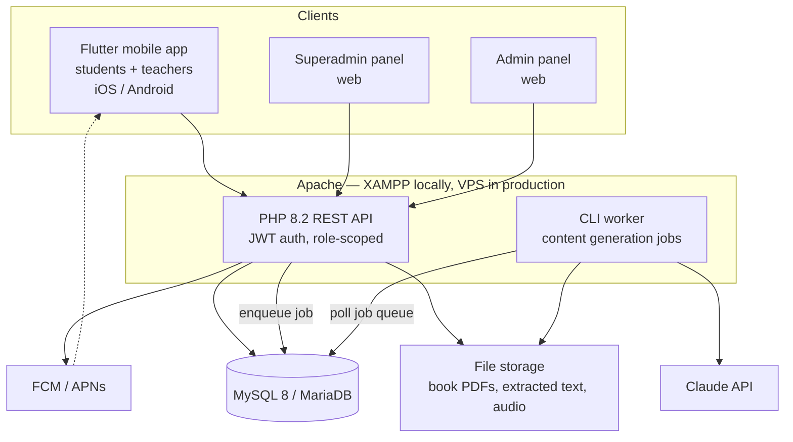

# Dana — Architecture

> **Status:** DRAFT — production host still open (Q-36); local XAMPP for now.
> **Last updated:** 2026-08-04

## Components



## Stack

| Layer | Choice | Note |
|---|---|---|
| Mobile | Flutter 3.x (Dart) | Students + teachers, one app, role-based shell |
| State | Riverpod + `go_router` | |
| Local cache | `drift` (SQLite) | Read-cache for grammar/vocabulary; full offline is Q-32 |
| API | PHP 8.2, Slim 4 + Eloquent | Runs unmodified on XAMPP and on a production LAMP box |
| DB | MySQL 8 / MariaDB 10.6+ | InnoDB, `utf8mb4_unicode_ci` |
| Auth | JWT access (15 min) + refresh (30 d), rotating | No email, no self-signup |
| Admin panels | React + Vite + TypeScript → static build served by Apache | Decided (Q-40) |
| Background jobs | PHP CLI worker + MySQL-backed queue table | No Redis/Docker dependency — matches your XAMPP setup |
| AI | `LlmProvider` interface — Claude enabled; Gemini + DeepSeek adapters ready | Decided (Q-41) |
| Push | FCM + APNs primary; in-app inbox secondary | Decided (Q-37) |

**Why a MySQL job queue and not Redis:** content generation is slow
(minutes per unit section) and low-volume (a few runs per day at most).
A `jobs` table polled by a CLI worker adds zero infrastructure, survives
restarts, and gives the superadmin panel a natural place to show
progress and failures.

## Repository layout

```
Dana/
├── docs/                      source of truth — read before changing code
├── app/                       Flutter mobile app
│   ├── lib/
│   │   ├── core/              theme, l10n (tk/ru), http, storage, errors
│   │   ├── data/              api clients, DTOs, repositories
│   │   ├── features/
│   │   │   ├── auth/
│   │   │   ├── student/       home, units, grammar, vocabulary,
│   │   │   │                  exercises, leaderboard, profile
│   │   │   └── teacher/       classrooms, students, unlock sections,
│   │   │                      progress, leaderboard
│   │   └── shared/            widgets shared by both roles
│   └── test/
├── api/                       PHP REST API
│   ├── public/index.php       single entry point
│   ├── src/
│   │   ├── Http/              routes, controllers, middleware
│   │   ├── Domain/            entities, services, policies
│   │   ├── Content/           ingestion, generation, validation gates
│   │   └── Support/
│   ├── database/migrations/
│   ├── bin/worker.php         background job runner
│   └── tests/
├── panel/                     React admin + superadmin SPA
└── storage/                   uploaded books, extracted text (outside web root)
```

Superadmin and admin share one SPA build; the JWT's role claim decides
which navigation and routes render. Two separate deployments would
duplicate ~80% of the code for no benefit.

## Authorisation model

Every request carries a JWT with `sub`, `role`, and `center_id`. A
single middleware enforces scope before any controller runs:

| Role | Scope enforced |
|---|---|
| `superadmin` | none — full access |
| `admin` | every query filtered to `center_id` |
| `teacher` | every query filtered to classrooms where `teacher_id = sub` |
| `student` | every query filtered to own `student_id` + own classroom memberships |

Scope is applied at the repository layer, not per-controller, so a
forgotten check cannot leak another centre's data.

## API conventions

- Base path `/api/v1`, JSON only, `snake_case` fields.
- Errors: `{ "error": { "code": "...", "message_tk": "...", "message_ru": "..." } }`
  — user-facing messages are bilingual and come from the server, so the
  app never has to translate a backend failure.
- All list endpoints paginate: `?page=&per_page=` (max 100).
- Timestamps are UTC ISO-8601; the app renders in local time.

## Deployment

**Local (your machine):** XAMPP — Apache serves `api/public` and
`panel/dist`; MySQL from the XAMPP stack; `php api/bin/worker.php` runs
in a second terminal.

**Production:** host not yet chosen (Q-36). Everything environment-specific
lives in `api/.env` — database credentials, `APP_CRED_KEY`, LLM keys,
base URL, storage path — so moving from the XAMPP machine to a real
server is configuration, not a rewrite. The API targets plain LAMP
conventions and deploys to a VPS or cPanel host unchanged; the worker
runs under `systemd` on a VPS, or cron on shared hosting.

**Nothing in the code may assume `localhost`.** The Flutter app reads
its API base URL from a build-time `--dart-define`, so the same source
produces a local-testing build and a production build.

## LLM provider abstraction (FR-4.18)

```php
interface LlmProvider {
    public function complete(Prompt $p, JsonSchema $schema): LlmResult;
    public function name(): string;      // 'claude' | 'gemini' | 'deepseek'
}
```

`ClaudeProvider` is the only implementation wired up now
(`claude-opus-5` for generation, `claude-sonnet-5` for the G8 judge and
bulk passes). `GeminiProvider` and `DeepSeekProvider` are written
against the same interface and stay dormant until their keys appear in
`.env`. Provider selection is `LLM_PROVIDER=claude` in config, plus an
override per generation run so you can A/B a section across providers.

Every run records which `provider` and `model` produced it, so content
generated by different models stays distinguishable after the fact.

## Logging

Monolog, one rotating file per channel in `storage/logs/`, kept 30 days:

| Channel | Contents |
|---|---|
| `auth-YYYY-MM-DD.log` | logins, failures with reason, refreshes, ended sessions |
| `app-YYYY-MM-DD.log` | unexpected exceptions with type, file, route and trace |
| `worker-YYYY-MM-DD.log` | content generation runs |

**Never logged:** passwords, access tokens, refresh tokens, or
`APP_CRED_KEY`. Logs record identifiers and outcomes — enough to
investigate an incident, not enough to become one.

**Logs are not the audit trail.** Security-relevant *actions* — password
reveals (FR-1.12), section unlocks, course closures — go to the
`audit_log` table, because those must be queryable and must survive log
rotation. The log files are for diagnosis; the table is the record.

One thing worth watching in `auth.log`: repeated
`previous student session ended` entries on a single account usually mean
the credentials are being shared around a classroom (FR-12.2).

## Non-negotiables

1. **The AI never runs on the client.** Generation is a backend job.
   No API key ever ships in the app binary.
2. **Students never receive unpublished content.** Enforced in the
   repository layer, not the UI (see Q-27).
3. **Points are computed server-side.** The client sends answers, not
   scores. A tampered client cannot inflate a leaderboard.
4. **Scope filtering lives in one place.** Never re-implemented per
   endpoint.
5. **Login never decrypts a credential.** Authentication uses the bcrypt
   hash only; the reveal path (FR-1.10) is separate, scoped, rate-limited
   and audit-logged. See [04-DATA-MODEL.md](04-DATA-MODEL.md#credential-storage).
