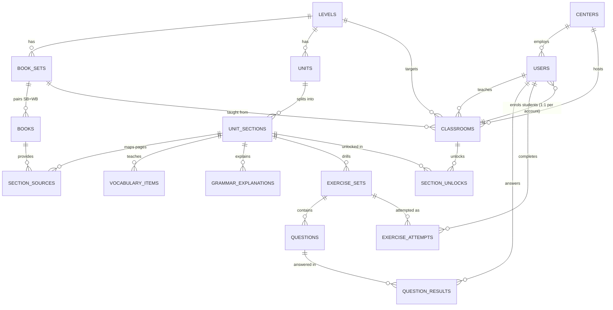

# Dana — Data Model

> **Status:** DRAFT. Several tables change depending on Q-3, Q-9, Q-19,
> Q-20 and Q-21 — those spots are marked inline. MySQL 8 / MariaDB
> 10.6+, InnoDB, `utf8mb4_unicode_ci`.
> **Last updated:** 2026-08-04

## Entity overview



## Organisation

```sql
CREATE TABLE centers (
  id           BIGINT UNSIGNED PRIMARY KEY AUTO_INCREMENT,
  name         VARCHAR(160) NOT NULL,
  city         VARCHAR(120) NULL,
  address      VARCHAR(255) NULL,
  is_active    TINYINT(1) NOT NULL DEFAULT 1,
  created_at   DATETIME NOT NULL,
  updated_at   DATETIME NOT NULL
);

-- One table for all four roles. Auth, scoping and audit stay in one place.
CREATE TABLE users (
  id             BIGINT UNSIGNED PRIMARY KEY AUTO_INCREMENT,
  role           ENUM('superadmin','admin','teacher','student') NOT NULL,
  center_id      BIGINT UNSIGNED NULL,          -- NULL only for superadmin
  -- FR-1.13: students belong to exactly one classroom, for the life of
  -- the account. NULL for every other role. FK added after classrooms.
  classroom_id   BIGINT UNSIGNED NULL,
  -- FR-1.16: the login identifier is a PHONE NUMBER, entered by the
  -- teacher (or admin) at account creation. Stored E.164, e.g.
  -- '+99365002223'. Unique system-wide. Never SMS-verified.
  login          VARCHAR(20) NOT NULL,
  -- Authentication path. Every login checks this and only this.
  password_hash  VARCHAR(255) NOT NULL,          -- bcrypt, cost 12
  -- Display path (FR-1.10, FR-13.18 + migration 010). Populated for
  -- role IN ('student','teacher'); NULL for admin/superadmin.
  password_ct    VARBINARY(320) NULL,            -- AES-256-GCM ciphertext
  password_iv    BINARY(12) NULL,
  password_tag   BINARY(16) NULL,
  password_set_at DATETIME NULL,
  full_name      VARCHAR(160) NOT NULL,
  phone          VARCHAR(32) NULL,
  interface_lang ENUM('tk','ru') NULL,           -- Q-44
  is_active      TINYINT(1) NOT NULL DEFAULT 1,  -- Q-8: soft delete
  created_by     BIGINT UNSIGNED NULL,
  last_login_at  DATETIME NULL,
  created_at     DATETIME NOT NULL,
  updated_at     DATETIME NOT NULL,
  UNIQUE KEY uq_users_login (login),
  KEY ix_users_center_role (center_id, role, is_active),
  CONSTRAINT fk_users_center  FOREIGN KEY (center_id) REFERENCES centers(id),
  CONSTRAINT fk_users_creator FOREIGN KEY (created_by) REFERENCES users(id)
);

-- Q-6: one active session per student
CREATE TABLE refresh_tokens (
  id          BIGINT UNSIGNED PRIMARY KEY AUTO_INCREMENT,
  user_id     BIGINT UNSIGNED NOT NULL,
  token_hash  CHAR(64) NOT NULL,
  device_info VARCHAR(255) NULL,
  expires_at  DATETIME NOT NULL,
  revoked_at  DATETIME NULL,
  created_at  DATETIME NOT NULL,
  UNIQUE KEY uq_refresh_hash (token_hash),
  KEY ix_refresh_user (user_id, revoked_at),
  CONSTRAINT fk_refresh_user FOREIGN KEY (user_id) REFERENCES users(id) ON DELETE CASCADE
);
```

### Credential storage

*Resolves Q-2. Implements FR-1.10, FR-1.12; amended by FR-13.17/FR-13.18
(2026-08, migration 010).*

The centre admin must be able to read a student's or teacher's current
password back to them (FR-13.18), so those passwords have to be
recoverable. Recoverable storage is weaker than hashing by definition,
so the design confines that weakness to one narrow, audited path:

| | Authentication | Display |
|---|---|---|
| Stored as | bcrypt hash (`password_hash`) | AES-256-GCM ciphertext (`password_ct`) |
| Who it exists for | all roles | `role IN ('student','teacher')` |
| Used by | `POST /auth/login` | `GET /manage/students/{id}/credential`, `GET /manage/staff/{id}/credential` |
| Reversible | no | yes, with the key |

**Rules the implementation must hold to:**

1. **Login never decrypts.** Authentication compares against
   `password_hash` exclusively. A defect in the reveal endpoint
   therefore cannot become an authentication bypass.
2. **The key is not in the database.** `APP_CRED_KEY` (32 random bytes,
   base64) lives in `api/.env`, outside the web root, excluded from
   version control and from database backups. A leaked SQL dump on its
   own yields nothing.
3. **Students and teachers only** (FR-13.18, migration 010). Superadmin
   and admin rows keep `password_ct = NULL`; their passwords are
   reset-only. Teachers created before migration 010 also carry NULL —
   the reveal answers 422 until an admin sets a new password, which
   writes the recoverable copy.
4. **Reveal is scoped and explicit** (FR-13.17: admin-only — the
   teacher's reveal authority is gone). `GET /manage/students/{id}/credential`
   and `GET /manage/staff/{id}/credential` are permitted only to the
   centre admin of the subject's own centre, return one credential at a
   time, are rate-limited, and are never included in any list or export
   endpoint.
5. **Every reveal is logged.** An `audit_log` row with action
   `student.password_viewed` / `staff.password_viewed` recording actor,
   subject, IP and timestamp — written before the response is returned,
   so a failure to log is a failure to reveal.
6. **Rotation is supported.** `password_set_at` allows re-encrypting all
   student credentials under a new key without touching hashes.

## Curriculum

```sql
CREATE TABLE levels (
  id         BIGINT UNSIGNED PRIMARY KEY AUTO_INCREMENT,
  name       VARCHAR(80) NOT NULL,     -- Beginner … Advanced, editable (FR-3.3)
  slug       VARCHAR(80) NOT NULL,
  sort_order SMALLINT NOT NULL,
  is_active  TINYINT(1) NOT NULL DEFAULT 1,
  created_at DATETIME NOT NULL,
  updated_at DATETIME NOT NULL,
  UNIQUE KEY uq_levels_slug (slug)
);

-- FR-3.10: a Student's Book + Workbook pair. Classrooms target a set,
-- not an individual book. FR-3.9: no series is assumed — whatever the
-- superadmin uploads defines the structure.
CREATE TABLE book_sets (
  id         BIGINT UNSIGNED PRIMARY KEY AUTO_INCREMENT,
  level_id   BIGINT UNSIGNED NOT NULL,
  name       VARCHAR(200) NOT NULL,   -- free text, e.g. "Beginner — 3rd edition"
  is_active  TINYINT(1) NOT NULL DEFAULT 1,
  created_at DATETIME NOT NULL,
  updated_at DATETIME NOT NULL,
  KEY ix_sets_level (level_id, is_active),
  CONSTRAINT fk_bookset_level FOREIGN KEY (level_id) REFERENCES levels(id)
);

CREATE TABLE books (
  id            BIGINT UNSIGNED PRIMARY KEY AUTO_INCREMENT,
  book_set_id   BIGINT UNSIGNED NOT NULL,
  level_id      BIGINT UNSIGNED NOT NULL,
  kind          ENUM('students_book','workbook') NOT NULL,
  title         VARCHAR(200) NOT NULL,
  edition       VARCHAR(80) NULL,
  file_path     VARCHAR(255) NOT NULL,   -- outside web root (Q-17)
  page_count    SMALLINT UNSIGNED NULL,
  text_status   ENUM('pending','extracting','ready','failed') NOT NULL DEFAULT 'pending',
  needs_ocr     TINYINT(1) NOT NULL DEFAULT 0,   -- Q-12
  created_at    DATETIME NOT NULL,
  updated_at    DATETIME NOT NULL,
  KEY ix_books_level (level_id, kind),
  -- one Student's Book and one Workbook per set
  UNIQUE KEY uq_book_kind (book_set_id, kind),
  CONSTRAINT fk_books_set   FOREIGN KEY (book_set_id) REFERENCES book_sets(id) ON DELETE CASCADE,
  CONSTRAINT fk_books_level FOREIGN KEY (level_id) REFERENCES levels(id)
);

-- Extracted page text, one row per page. Generation reads only from here.
CREATE TABLE book_pages (
  id          BIGINT UNSIGNED PRIMARY KEY AUTO_INCREMENT,
  book_id     BIGINT UNSIGNED NOT NULL,
  page_number SMALLINT UNSIGNED NOT NULL,
  raw_text    MEDIUMTEXT NULL,
  ocr_used    TINYINT(1) NOT NULL DEFAULT 0,
  UNIQUE KEY uq_page (book_id, page_number),
  CONSTRAINT fk_pages_book FOREIGN KEY (book_id) REFERENCES books(id) ON DELETE CASCADE
);

CREATE TABLE units (
  id         BIGINT UNSIGNED PRIMARY KEY AUTO_INCREMENT,
  level_id   BIGINT UNSIGNED NOT NULL,
  number     SMALLINT UNSIGNED NOT NULL,   -- 1, 2, 3 …
  title      VARCHAR(200) NULL,
  sort_order SMALLINT NOT NULL,
  UNIQUE KEY uq_unit (level_id, number),
  CONSTRAINT fk_units_level FOREIGN KEY (level_id) REFERENCES levels(id)
);

-- The atomic unit of the system: 1A, 1B, …  (Q-18, Q-19)
CREATE TABLE unit_sections (
  id         BIGINT UNSIGNED PRIMARY KEY AUTO_INCREMENT,
  unit_id    BIGINT UNSIGNED NOT NULL,
  code       VARCHAR(8) NOT NULL,          -- 'A', 'B', 'C' → displayed as 1A
  title      VARCHAR(200) NULL,
  sort_order SMALLINT NOT NULL,
  -- global teaching order across the whole level; drives the grammar
  -- ceiling in FR-4.6 (everything with a lower value is "already taught")
  level_position INT UNSIGNED NOT NULL,
  UNIQUE KEY uq_section (unit_id, code),
  CONSTRAINT fk_sections_unit FOREIGN KEY (unit_id) REFERENCES units(id)
);

-- Q-14: which book pages belong to this section. Manually confirmed.
CREATE TABLE section_sources (
  id              BIGINT UNSIGNED PRIMARY KEY AUTO_INCREMENT,
  unit_section_id BIGINT UNSIGNED NOT NULL,
  book_id         BIGINT UNSIGNED NOT NULL,
  page_from       SMALLINT UNSIGNED NOT NULL,
  page_to         SMALLINT UNSIGNED NOT NULL,
  -- pages/regions to skip: listening scripts, reading passages, speaking tasks (FR-4.9)
  exclusions      JSON NULL,
  confirmed_by    BIGINT UNSIGNED NULL,
  confirmed_at    DATETIME NULL,
  KEY ix_srcs_section (unit_section_id),
  CONSTRAINT fk_srcs_section FOREIGN KEY (unit_section_id) REFERENCES unit_sections(id) ON DELETE CASCADE,
  CONSTRAINT fk_srcs_book    FOREIGN KEY (book_id) REFERENCES books(id)
);
```

## Section content

```sql
CREATE TABLE vocabulary_items (
  id              BIGINT UNSIGNED PRIMARY KEY AUTO_INCREMENT,
  unit_section_id BIGINT UNSIGNED NOT NULL,
  term_en         VARCHAR(160) NOT NULL,
  part_of_speech  VARCHAR(32) NULL,
  ipa             VARCHAR(120) NULL,
  translation_tk  VARCHAR(255) NOT NULL,
  translation_ru  VARCHAR(255) NOT NULL,
  example_en      VARCHAR(500) NULL,
  audio_path      VARCHAR(255) NULL,
  sort_order      SMALLINT NOT NULL DEFAULT 0,
  created_at      DATETIME NOT NULL,
  updated_at      DATETIME NOT NULL,
  KEY ix_vocab_section (unit_section_id),
  CONSTRAINT fk_vocab_section FOREIGN KEY (unit_section_id) REFERENCES unit_sections(id) ON DELETE CASCADE
);

-- FR-5: one row per section, both languages side by side
CREATE TABLE grammar_explanations (
  id              BIGINT UNSIGNED PRIMARY KEY AUTO_INCREMENT,
  unit_section_id BIGINT UNSIGNED NOT NULL,
  title_tk        VARCHAR(200) NOT NULL,
  title_ru        VARCHAR(200) NOT NULL,
  body_tk         MEDIUMTEXT NOT NULL,   -- markdown
  body_ru         MEDIUMTEXT NOT NULL,
  examples        JSON NULL,             -- [{en, note_tk, note_ru}]
  status          ENUM('draft','in_review','published') NOT NULL DEFAULT 'draft',
  generated_run_id BIGINT UNSIGNED NULL,
  created_at      DATETIME NOT NULL,
  updated_at      DATETIME NOT NULL,
  UNIQUE KEY uq_grammar_section (unit_section_id),
  CONSTRAINT fk_grammar_section FOREIGN KEY (unit_section_id) REFERENCES unit_sections(id) ON DELETE CASCADE
);
```

## Exercises

```sql
CREATE TABLE exercise_sets (
  id               BIGINT UNSIGNED PRIMARY KEY AUTO_INCREMENT,
  unit_section_id  BIGINT UNSIGNED NOT NULL,
  type             ENUM('reorder','match_pairs','multiple_choice','fill_blank') NOT NULL,
  title_tk         VARCHAR(200) NOT NULL,
  title_ru         VARCHAR(200) NOT NULL,
  instructions_tk  VARCHAR(500) NULL,
  instructions_ru  VARCHAR(500) NULL,
  -- fill_blank only. v1 is always 'word_bank' (FR-4.19); 'typing' exists
  -- for a later level-dependent option and is unused for now.
  input_mode       ENUM('typing','word_bank') NULL,
  -- match_pairs only (FR-4.16)
  pair_mode        ENUM('translation','definition','sentence_halves',
                        'question_answer','synonym','antonym') NULL,
  status           ENUM('draft','in_review','published') NOT NULL DEFAULT 'draft',
  generated_run_id BIGINT UNSIGNED NULL,
  sort_order       SMALLINT NOT NULL DEFAULT 0,
  created_at       DATETIME NOT NULL,
  updated_at       DATETIME NOT NULL,
  KEY ix_sets_section (unit_section_id, status),
  CONSTRAINT fk_sets_section FOREIGN KEY (unit_section_id) REFERENCES unit_sections(id) ON DELETE CASCADE
);

-- Q-20 assumes: English content + bilingual instructions.
-- If you choose full translation, prompt_tk/prompt_ru carry the whole question.
CREATE TABLE questions (
  id              BIGINT UNSIGNED PRIMARY KEY AUTO_INCREMENT,
  exercise_set_id BIGINT UNSIGNED NOT NULL,
  sort_order      SMALLINT NOT NULL,
  prompt_tk       VARCHAR(500) NULL,   -- editor: left column
  prompt_ru       VARCHAR(500) NULL,   -- editor: right column
  payload         JSON NOT NULL,       -- shape varies by set type, see below
  -- provenance for FR-4.3 / FR-4.4 auditing
  source_book_id  BIGINT UNSIGNED NULL,
  source_page     SMALLINT UNSIGNED NULL,
  source_sentence TEXT NULL,
  change_ratio    DECIMAL(4,3) NULL,   -- measured, must land in 0.20–0.25
  is_active       TINYINT(1) NOT NULL DEFAULT 1,
  created_at      DATETIME NOT NULL,
  updated_at      DATETIME NOT NULL,
  KEY ix_q_set (exercise_set_id, sort_order),
  CONSTRAINT fk_q_set FOREIGN KEY (exercise_set_id) REFERENCES exercise_sets(id) ON DELETE CASCADE
);
```

### `questions.payload` shapes

```jsonc
// reorder — Q-22 assumes words→sentence
{ "tokens": ["She", "goes", "to", "school"], "answer": [0,1,2,3] }

// match_pairs — shape depends on exercise_sets.pair_mode (FR-4.16)
// pair_mode = "translation"      → right side is bilingual
{ "pairs": [ { "left": "teacher", "right_tk": "mugallym", "right_ru": "учитель" } ] }
// pair_mode = "definition" | "sentence_halves" | "question_answer"
//           | "synonym" | "antonym"    → both sides English
{ "pairs": [ { "left": "teacher", "right": "a person who teaches at a school" } ] }

// multiple_choice — exactly 1 correct + 3 incorrect (FR-4.10)
{ "stem": "She ___ to school every day.",
  "options": ["goes", "go", "going", "gone"], "answer": 0 }

// fill_blank — one blank, always tap-to-fill from the bank (FR-4.19).
// Distractors in the bank are drawn from the vocabulary ceiling.
{ "before": "She ", "after": " to school every day.",
  "answer": ["goes"], "word_bank": ["goes","go","going","gone"] }
```

## Classrooms & unlocking

```sql
CREATE TABLE classrooms (
  id           BIGINT UNSIGNED PRIMARY KEY AUTO_INCREMENT,
  center_id    BIGINT UNSIGNED NOT NULL,
  teacher_id   BIGINT UNSIGNED NOT NULL,
  level_id     BIGINT UNSIGNED NOT NULL,
  name         VARCHAR(120) NOT NULL,
  book_set_id  BIGINT UNSIGNED NOT NULL,   -- SB + WB pair (FR-3.10)
  started_on   DATE NULL,
  closed_at    DATETIME NULL,              -- course finished → purge runs (FR-1.14)
  capacity     SMALLINT UNSIGNED NULL,
  is_active    TINYINT(1) NOT NULL DEFAULT 1,
  created_by   BIGINT UNSIGNED NOT NULL,
  created_at   DATETIME NOT NULL,
  updated_at   DATETIME NOT NULL,
  KEY ix_class_center (center_id, is_active),
  KEY ix_class_teacher (teacher_id, is_active),
  CONSTRAINT fk_class_center  FOREIGN KEY (center_id) REFERENCES centers(id),
  CONSTRAINT fk_class_teacher FOREIGN KEY (teacher_id) REFERENCES users(id),
  CONSTRAINT fk_class_level   FOREIGN KEY (level_id) REFERENCES levels(id),
  CONSTRAINT fk_class_bookset FOREIGN KEY (book_set_id) REFERENCES book_sets(id)
);

-- FR-1.13: no join table. One student account, one classroom, enforced
-- by the column itself — multi-classroom membership is structurally
-- impossible rather than merely discouraged.
ALTER TABLE users
  ADD CONSTRAINT fk_users_classroom
  FOREIGN KEY (classroom_id) REFERENCES classrooms(id);

ALTER TABLE users
  ADD KEY ix_users_classroom (classroom_id, is_active);

-- FR-7: teacher opens a section for one classroom (Q-28)
CREATE TABLE section_unlocks (
  id              BIGINT UNSIGNED PRIMARY KEY AUTO_INCREMENT,
  classroom_id    BIGINT UNSIGNED NOT NULL,
  unit_section_id BIGINT UNSIGNED NOT NULL,
  unlocked_by     BIGINT UNSIGNED NOT NULL,
  unlocked_at     DATETIME NOT NULL,
  UNIQUE KEY uq_unlock (classroom_id, unit_section_id),
  CONSTRAINT fk_unlock_class   FOREIGN KEY (classroom_id) REFERENCES classrooms(id) ON DELETE CASCADE,
  CONSTRAINT fk_unlock_section FOREIGN KEY (unit_section_id) REFERENCES unit_sections(id)
);
```

## Progress & points

The rule in FR-8.4 — *points once per question, ever* — is enforced by a
unique key, not by application logic. This is the single most important
integrity constraint in the schema.

```sql
CREATE TABLE question_results (
  id              BIGINT UNSIGNED PRIMARY KEY AUTO_INCREMENT,
  student_id      BIGINT UNSIGNED NOT NULL,
  question_id     BIGINT UNSIGNED NOT NULL,
  classroom_id    BIGINT UNSIGNED NOT NULL,  -- leaderboard scope (Q-4)
  first_correct   TINYINT(1) NOT NULL,       -- outcome of the FIRST attempt
  points_awarded  TINYINT UNSIGNED NOT NULL, -- 5 or 3, never anything else
  attempts        SMALLINT UNSIGNED NOT NULL DEFAULT 1,
  resolved_at     DATETIME NULL,             -- when finally answered correctly
  created_at      DATETIME NOT NULL,
  -- FR-8.4 / FR-8.6: a student can score a given question exactly once
  UNIQUE KEY uq_result (student_id, question_id),
  KEY ix_result_board (classroom_id, student_id),
  CONSTRAINT fk_res_student FOREIGN KEY (student_id) REFERENCES users(id),
  CONSTRAINT fk_res_question FOREIGN KEY (question_id) REFERENCES questions(id) ON DELETE CASCADE
);

CREATE TABLE exercise_attempts (
  id              BIGINT UNSIGNED PRIMARY KEY AUTO_INCREMENT,
  student_id      BIGINT UNSIGNED NOT NULL,
  exercise_set_id BIGINT UNSIGNED NOT NULL,
  classroom_id    BIGINT UNSIGNED NOT NULL,
  status          ENUM('in_progress','completed','abandoned') NOT NULL DEFAULT 'in_progress',
  points_total    SMALLINT UNSIGNED NOT NULL DEFAULT 0,
  correct_count   SMALLINT UNSIGNED NOT NULL DEFAULT 0,
  question_count  SMALLINT UNSIGNED NOT NULL,
  started_at      DATETIME NOT NULL,
  completed_at    DATETIME NULL,
  KEY ix_attempt_student (student_id, exercise_set_id),
  CONSTRAINT fk_att_student FOREIGN KEY (student_id) REFERENCES users(id),
  CONSTRAINT fk_att_set     FOREIGN KEY (exercise_set_id) REFERENCES exercise_sets(id) ON DELETE CASCADE
);
```

**Commit rule (FR-8.7).** Rows are written to `question_results` only in
the transaction that flips `exercise_attempts.status` to `completed`.
While a set is in progress the client holds answers locally and the
server stores nothing scoring-related. An abandoned attempt leaves no
`question_results` rows, so the student can start clean.

**Leaderboard** is served from a maintained aggregate, not a scan
(NFR-2 — at 100,000 students `question_results` reaches tens of millions
of rows):

```sql
CREATE TABLE student_scores (
  student_id     BIGINT UNSIGNED PRIMARY KEY,
  classroom_id   BIGINT UNSIGNED NOT NULL,
  points_total   INT UNSIGNED NOT NULL DEFAULT 0,
  questions_done INT UNSIGNED NOT NULL DEFAULT 0,
  correct_count  INT UNSIGNED NOT NULL DEFAULT 0,
  last_scored_at DATETIME NULL,     -- Q-30 tie-break: earliest to reach the score wins
  KEY ix_scores_board (classroom_id, points_total DESC),
  CONSTRAINT fk_scores_student FOREIGN KEY (student_id) REFERENCES users(id) ON DELETE CASCADE
);
```

Updated in the **same transaction** that completes an exercise attempt,
so it can never drift from `question_results`. The leaderboard read is
then a single indexed range scan over one classroom:

```sql
SELECT student_id, points_total
FROM student_scores
WHERE classroom_id = ?
ORDER BY points_total DESC, last_scored_at ASC;
```

## Engagement features

*Implements FR-6.3 (bookmarks), FR-8.10 (streak), FR-8.11 (study time).*

```sql
-- FR-6.3: "All Words / Bookmarked" tabs on the vocabulary screen
CREATE TABLE student_bookmarks (
  student_id         BIGINT UNSIGNED NOT NULL,
  vocabulary_item_id BIGINT UNSIGNED NOT NULL,
  created_at         DATETIME NOT NULL,
  PRIMARY KEY (student_id, vocabulary_item_id),
  CONSTRAINT fk_bm_student FOREIGN KEY (student_id) REFERENCES users(id) ON DELETE CASCADE,
  CONSTRAINT fk_bm_vocab   FOREIGN KEY (vocabulary_item_id) REFERENCES vocabulary_items(id) ON DELETE CASCADE
);

-- One row per student per active day. Serves BOTH profile stats:
-- study time is SUM(seconds_studied); streak is the run of consecutive
-- dates ending today or yesterday.
CREATE TABLE student_activity_days (
  student_id          BIGINT UNSIGNED NOT NULL,
  activity_date       DATE NOT NULL,          -- Asia/Ashgabat, server-side (FR-8.10)
  seconds_studied     INT UNSIGNED NOT NULL DEFAULT 0,
  exercises_completed SMALLINT UNSIGNED NOT NULL DEFAULT 0,
  PRIMARY KEY (student_id, activity_date),
  CONSTRAINT fk_act_student FOREIGN KEY (student_id) REFERENCES users(id) ON DELETE CASCADE
);
```

**Why one table for both.** Study time and streak are two readings of
the same underlying fact — "this student was active on this day, for
this long". Keeping them together means they can never disagree, and the
profile screen is a single indexed lookup.

**Streak integrity.** `activity_date` is computed **server-side** in
Asia/Ashgabat (UTC+5, no DST), never from the device clock. A student
cannot extend a streak by changing their phone's date. A day counts only
if `exercises_completed > 0` — opening the app is not studying.

**Study time integrity.** The client sends periodic heartbeats while an
exercise, grammar or vocabulary screen is in the foreground; the server
accumulates them into `seconds_studied`. Heartbeats stop on background,
and a heartbeat gap longer than the interval is not back-filled, so idle
time is excluded rather than assumed.

## Data retention

*Implements FR-1.14 (Q-3).*

A course ends when an admin sets `classrooms.closed_at`. That action:

1. Sets `is_active = 0` on every student in the classroom — they can no
   longer log in.
2. Clears their credentials: `password_hash`, `password_ct`,
   `password_iv`, `password_tag` are nulled/randomised.
3. Deletes their `question_results`, `exercise_attempts`,
   `student_scores`, `student_bookmarks` and `student_activity_days` rows.
4. Writes one `audit_log` entry recording the closure and the number of
   accounts affected.

**Consequence worth deciding on:** once purged, nobody — admin or
superadmin — can see any progress or leaderboard data for that course
again. If you ever want an end-of-course report, it has to be produced
**before** closing. The closure screen therefore offers a CSV export
first and requires the admin to confirm; the export is a file they
download, not a stored record, so "nothing is stored" still holds. Tell
me if you would rather it purge immediately with no export offered.

The purge also keeps the hot tables bounded, which is what makes the
100,000-student target (NFR-1) comfortable on a single MySQL instance.

## Generation jobs & notifications

```sql
CREATE TABLE generation_runs (
  id              BIGINT UNSIGNED PRIMARY KEY AUTO_INCREMENT,
  unit_section_id BIGINT UNSIGNED NOT NULL,
  target          ENUM('exercises','grammar','both') NOT NULL,
  status          ENUM('queued','running','needs_review','failed','published') NOT NULL DEFAULT 'queued',
  requested_by    BIGINT UNSIGNED NOT NULL,
  provider        ENUM('claude','gemini','deepseek') NOT NULL DEFAULT 'claude',  -- FR-4.18
  model           VARCHAR(64) NULL,
  prompt_version  VARCHAR(32) NULL,
  input_tokens    INT UNSIGNED NULL,
  output_tokens   INT UNSIGNED NULL,
  validation      JSON NULL,   -- per-gate pass/fail, see 05-CONTENT-PIPELINE.md
  error_message   TEXT NULL,
  started_at      DATETIME NULL,
  finished_at     DATETIME NULL,
  created_at      DATETIME NOT NULL,
  KEY ix_runs_status (status, created_at)
);

CREATE TABLE notifications (
  id         BIGINT UNSIGNED PRIMARY KEY AUTO_INCREMENT,
  sender_id  BIGINT UNSIGNED NOT NULL,
  scope      ENUM('all','center','classroom') NOT NULL,
  center_id  BIGINT UNSIGNED NULL,
  classroom_id BIGINT UNSIGNED NULL,       -- Q-35
  title_tk   VARCHAR(160) NOT NULL,
  title_ru   VARCHAR(160) NOT NULL,
  body_tk    VARCHAR(1000) NOT NULL,
  body_ru    VARCHAR(1000) NOT NULL,
  sent_at    DATETIME NULL,
  created_at DATETIME NOT NULL
);

-- in-app inbox: the fallback that works even when FCM/APNs is unreachable (Q-37)
CREATE TABLE notification_receipts (
  id              BIGINT UNSIGNED PRIMARY KEY AUTO_INCREMENT,
  notification_id BIGINT UNSIGNED NOT NULL,
  user_id         BIGINT UNSIGNED NOT NULL,
  read_at         DATETIME NULL,
  UNIQUE KEY uq_receipt (notification_id, user_id),
  KEY ix_receipt_user (user_id, read_at)
);

CREATE TABLE device_tokens (
  id         BIGINT UNSIGNED PRIMARY KEY AUTO_INCREMENT,
  user_id    BIGINT UNSIGNED NOT NULL,
  token      VARCHAR(255) NOT NULL,
  platform   ENUM('ios','android') NOT NULL,
  updated_at DATETIME NOT NULL,
  UNIQUE KEY uq_token (token)
);

CREATE TABLE audit_log (
  id          BIGINT UNSIGNED PRIMARY KEY AUTO_INCREMENT,
  actor_id    BIGINT UNSIGNED NULL,
  action      VARCHAR(80) NOT NULL,     -- 'student.password_reset', 'section.unlock', …
  entity_type VARCHAR(80) NOT NULL,
  entity_id   BIGINT UNSIGNED NULL,
  meta        JSON NULL,
  ip          VARCHAR(45) NULL,
  created_at  DATETIME NOT NULL,
  KEY ix_audit_entity (entity_type, entity_id),
  KEY ix_audit_actor (actor_id, created_at)
);
```
