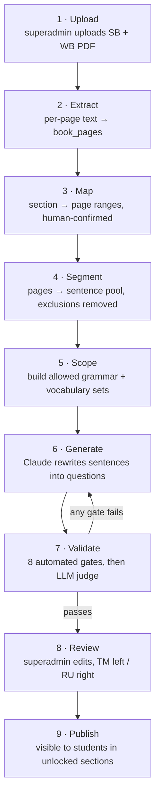

# Dana — AI Content Pipeline

> **Status: RETIRED 2026-08-07 (client decision).** AI generation was
> removed from the product: content is authored manually in the panel,
> copied 1:1 from the workbook, and published through the same review
> gate (FR-4.12 / FR-4.13 / FR-4.17). The generation endpoints are gone;
> the CLI scripts under `api/bin/` and the gates below are kept as
> history and in case the decision is ever reversed.
> **Last updated:** 2026-08-07

This document exists because of the specific risk you named: *the model
can hallucinate, drift out of level, or reach for grammar and vocabulary
the student hasn't met yet.* Everything below is designed to make that
structurally difficult rather than merely unlikely.

## The core principle

**The model is a rewriter, not an author.** Every generated question is
traceable to one sentence on one page of one book. A question with no
provenance is a bug, and the schema enforces this: `questions` carries
`source_book_id`, `source_page`, `source_sentence` and a measured
`change_ratio`.

**The pipeline is book-agnostic (FR-3.9).** No series, unit count or
section naming is hardcoded. It operates purely on what the superadmin
uploaded and the structure they defined for it — so a different
textbook, or a mid-course change of edition, needs no code change.

## Stages



Only stage 6 involves generation. Stages 4, 5 and 7 are deterministic
code and are where the safety actually comes from.

---

## Stage 2 — Text extraction

Books are text-selectable PDFs (Q-12 answered), so there is **no OCR
stage** and no per-unit proofing gate.

- `pdftotext -layout` per page → `book_pages.raw_text`.
- Extraction runs **once per book**. Generation never re-reads the PDF.
- If a page yields under 20 characters, it is flagged in the upload
  report — that means the page is an image and the pipeline would
  silently skip it. Better to catch it at upload than at generation.

## Stage 3 — Section → page mapping (FR-4.2)

The hard boundary. `section_sources` holds `page_from`/`page_to` per
book per section, plus an `exclusions` JSON listing regions to drop.

Generation loads **only** the pages in that range. There is no
whole-book context window, no retrieval across units, no "related
material". If page 12 isn't in the range for 1A, its content cannot
reach a 1A question.

`confirmed_by` must be non-null before a run can start (Q-14).

## Stage 4 — Sentence pool & exclusions (FR-4.9)

From the mapped pages, build a pool of candidate source sentences.
Dropped before the model ever sees them:

| Dropped | Detected by |
|---|---|
| Listening scripts and audio-track text | `exclusions` regions + track markers (`1.14`, `Listening`, `Audioscript`) |
| Reading passages and comprehension topics | `exclusions` regions + block length heuristic (>60 words of continuous prose) |
| Speaking / pairwork prompts | `exclusions` regions + cue markers (`In pairs`, `Talk about`, `Ask your partner`) |
| Headers, page numbers, publisher furniture | layout position + repetition across pages |
| Sentences under 4 or over 20 words | token count |
| **Textbook apparatus** — headings (`1A A cappuccino`), rubrics (`2 GRAMMAR`), instructions (`b Write I or You`), cross-references (`p.92 Grammar Bank`) | `APPARATUS_PATTERNS` |
| **Phonetic drills** (`/aɪ/ bike I'm nice`) | phonetic-symbol match |
| **Fragments** not ending in `.`/`!`/`?` (`1 I am (I'm`) | terminal punctuation check |
| **Number drills** (more digits than letters) | digit/letter ratio |
| **Dialogue speaker labels** (`Helen:`, `Barista 2:`) | stripped from the line, not dropped |

The apparatus filters matter more than they look. On a real Beginner
spread they cut the pool from 28 "sentences" to 5 genuine ones — the
other 23 were headings, rubrics and drills that are printed as sentences
but are not language to practise. Left in, they crowd out the real
material and the generator ends up rewriting the same usable sentence
over and over.

Sentences are also **deduplicated across the whole pool**, not per page:
a sentence printed on two pages would otherwise occupy two indices and
slip past the per-source cap below.

Every dropped block is logged in `generation_runs.validation` so you can
see exactly what was excluded and correct the ranges if it over-trimmed.

## Stage 5 — Scope sets (FR-4.6, FR-4.7, FR-4.8)

Two allow-lists are computed before generation, using
`unit_sections.level_position`:

**Grammar ceiling.** The union of grammar structures introduced by every
section at or below the current `level_position`, within the same level
and all lower levels. Anything above is forbidden. Structures are tagged
per section (AI proposes from the book's grammar bank, superadmin
confirms — same pattern as page mapping).

**Vocabulary ceiling.** The union of `vocabulary_items.term_en` for all
sections at or below `level_position`, plus a closed-class stoplist
(articles, pronouns, prepositions, auxiliaries, numerals). A content
word outside this union is a validation failure, not a stylistic note.

**Current-section emphasis.** At least **60%** of generated questions
must contain a `term_en` from the *current* section's vocabulary.

## Stage 6 — Generation

One request per exercise type per section. Prompt skeleton:

```
ROLE
You rewrite existing textbook sentences into exercises.
You never write new sentences from scratch.

SOURCE SENTENCES  (the only material you may use)
{numbered pool from stage 4}

CURRENT SECTION
Level: {level}   Unit: {unit}   Section: {code}

ALLOWED GRAMMAR  (nothing outside this list may appear)
{grammar ceiling}

ALLOWED VOCABULARY  (plus closed-class function words)
{vocabulary ceiling}

FOCUS VOCABULARY  (must appear in ≥60% of questions)
{current section vocabulary}

TASK
Produce {n} questions of type {type}.
For each question:
  - pick exactly one SOURCE SENTENCE
  - change 20–25% of its words — no less, no more
  - keep its grammatical structure, register and logic intact
  - substitutions must come from ALLOWED VOCABULARY
  - return the source sentence index alongside your output

FORBIDDEN
- inventing a sentence with no source index
- any grammar structure absent from ALLOWED GRAMMAR
- any content word absent from ALLOWED VOCABULARY
- content derived from listening, reading or speaking material

OUTPUT
Strict JSON matching the schema for type {type}. No prose.
```

Counts: 7–12 per set, except `match_pairs` at 4–5 (FR-4.11). Generation
requests 12 (or 5); validation may reduce the set but never below 7
(or 4).

**A type is never forced (FR-4.20).** If the mapped pages cannot yield
enough valid questions for a type — no dialogue for `question_answer`
pairs, too few suitable sentences for `reorder` — that type is **not
produced**, and the run reports *which* type was skipped and *why*. A
section with three strong exercise types is a correct result. Padding it
to four with weak or invented content is precisely the failure mode this
pipeline exists to prevent.

### What "change 20–25%" means, precisely

Both the model and the validator use the same definition:

```
normalise  = lowercase, strip punctuation, split on whitespace
change_ratio = token_levenshtein(source, output) / max(len(source), len(output))
```

Target band **0.20 – 0.25**. Accepted band **0.15 – 0.30** (a 6-word
sentence cannot land inside a 5-point window — one token is already
0.167). Outside that, the question is rejected and regenerated.

Worked example — source: `She goes to school every day by bus` (8 tokens).
Output: `He goes to work every day by bus` → 2 tokens changed →
`2/8 = 0.25`. ✅ In band.

`match_pairs` in `translation` and `definition` modes is exempt: it
draws from the vocabulary list rather than rewriting sentences, so
`change_ratio` is `NULL`. In `sentence_halves` and `question_answer`
modes it *does* rewrite source sentences, and the band applies normally.

### `match_pairs` modes (FR-4.16)

| `pair_mode` | Left | Right | Source | Change ratio |
|---|---|---|---|---|
| `translation` | English term | TM + RU translation | `vocabulary_items` | n/a |
| `definition` | English term | English definition | vocabulary + book glossary | n/a |
| `sentence_halves` | first half | second half | source sentence, split | enforced |
| `question_answer` | question | answer | source dialogue/exchange | enforced |
| `synonym` | English term | English synonym | vocabulary ceiling, **both sides** | n/a |
| `antonym` | English term | English antonym | vocabulary ceiling, **both sides** | n/a |

`synonym` and `antonym` (FR-4.21) are the most constrained modes: every
word on **both** sides must already be inside the vocabulary ceiling. In
early units too few words have been taught for four or five valid pairs
to exist, so these modes will often be unavailable — which under FR-4.20
means skipped and reported, never filled with untaught words.

The generator produces whichever modes the mapped pages can actually
support — `question_answer` needs dialogue on the page, `definition`
needs a glossary. Unsupported modes are reported, never faked.

## Stage 7 — Validation gates

Every gate runs on every question. Gates 1–7 are deterministic code.
Gate 8 is a second model call acting as a judge.

| Gate | Check | On failure |
|---|---|---|
| **G1 Provenance** | Source index resolves to a real sentence in the pool | Drop question |
| **G2 Change ratio** | `0.15 ≤ change_ratio ≤ 0.30` | Regenerate question |
| **G3 Vocabulary** | Every content word ∈ vocabulary ceiling ∪ stoplist | Regenerate question |
| **G4 Grammar** | No structure outside the grammar ceiling | Regenerate question |
| **G5 Focus** | ≥60% of set contains current-section vocabulary | Regenerate set |
| **G6 Type shape** | Payload matches the type's JSON schema; MC has exactly 1 correct + 3 distinct wrong; reorder has exactly one valid ordering; fill-blank has exactly one blank and a word bank whose distractors all sit inside the vocabulary ceiling | Drop question |
| **G7 Count** | 7–12 (or 4–5 for match_pairs) survive | Drop the whole type, report why (FR-4.20) — never pad |
| **G9 Source spread** | No source sentence used more than **twice** | Drop the extra item |

**Why two and not one.** Unbounded, the model fixates on one easy
sentence and returns a dozen near-identical variants of it, which drills
nothing. But one-per-sentence is too strict against real pages: after the
apparatus filters a Beginner spread yields about five usable sentences,
which would put every type under the 7-question floor and skip them all.
Two per sentence fills a set from a sparse page without letting any one
sentence dominate.

The better long-term answer is mapping the **Workbook** pages into the
same sections — a workbook exists precisely to supply extra practice
sentences, and doubles the pool without loosening any gate.

| Gate | Check | On failure |
|---|---|---|
| **G8 Judge** | Second model (the cheaper judge role), temperature 0, per surviving item: *is the completed sentence natural English a beginner book could print? does every wrong option, placed in the gap, produce a clearly wrong sentence? does a reorder allow exactly one order?* A missing verdict counts as a failure — the judge exists because the generator cannot grade itself | **Drop question** |
| **G10 Source-as-distractor** | Substituting any wrong option into the frame must not reproduce the source sentence. Closes the shipped defect where «Practise with other ___» marked *names* correct and the book's own *students* wrong | Drop question |
| **G11 Interchangeable options** | The answer and a distractor must not share a closed class (possessives, object pronouns, here/there, demonstratives, days, articles) — members substitute freely, so such banks have several right answers. One carve-out: subject pronouns pinned by an agreeing form of *be* («Where **are** ___ from?» keeps *they* against *she/he/it*). Also rejects grammar metalanguage (*singular*, *verb*…) anywhere inside an item | Drop question |

Added 2026-08-06 after the first generated batch shipped items with
multiple defensible answers, inverted answers and metalanguage
distractors. G10/G11 are deterministic and locked by
`tests/gates_test.php` — every test case is one of the shipped defects.

**Match pairs are no longer generated at all.** The pairs are the
section's own vocabulary list — term on the left, the student's-language
translation on the right (`pair_mode = translation`, bilingual
`right_tk`/`right_ru`). The vocabulary is already reviewed content
(FR-6.2), the relation is unambiguous, and the model's version produced
relation-free guessing games ("tree → house"). Fewer than 4 usable pairs
skips the set (FR-4.20).

**Item design rule** (prompted and judge-enforced): the gapped word is
always a word *kept* from the source sentence — the student is tested on
the book's language, so the book's word is the right answer. The 20–25%
change (FR-4.4) applies to *other* words, swapped like for like: a name
for a name, a day for a day. «See you on **Monday**» is a good rewrite
of «See you on Friday»; «Practise with other **names**» is forbidden.

Gate outcomes are stored in `generation_runs.validation` so a failed run
tells you *which* constraint it violated, not just that it failed.
Regeneration retries a question at most 3 times before dropping it.

## Stage 7b — Grammar explanations (FR-5)

Separate run, same page range, targeting the book's own grammar bank:

- Input: the section's grammar pages + the grammar ceiling.
- Output: `title_tk` / `title_ru`, `body_tk` / `body_ru` in markdown,
  and an `examples` array.
- Constraint: **simplify** the book's explanation — shorter sentences,
  no metalanguage the student hasn't met — and supply **at least twice
  as many examples** as the book gives.
- Every English example is itself validated against G3 and G4.
- Both languages are produced in one call so they stay parallel; a
  mismatch in example count between TM and RU fails the run.

## Stage 8 — Review (Q-27)

Nothing reaches a student without passing through the superadmin's
review screen. `status` moves `draft → in_review → published`, and the
student-facing repository filters on `published` at the data layer.

The review screen shows, per question:

- the **source sentence** and its page, beside the generated question
- the measured `change_ratio`
- any G8 judge warnings
- Turkmen on the left, Russian on the right, both editable (FR-4.13)
- add / delete / edit / save per question, and delete for the whole set

Manual edits set `generated_run_id` provenance aside and are marked as
human-authored, so a later regeneration never silently overwrites your
corrections.

## Cost & runtime

Rough order of magnitude per unit section: 4 exercise sets + 1 grammar
explanation ≈ 6–10 model calls including judge and regeneration passes.
For a 6-level course at roughly 11 units × 3 sections, that is ~200
sections — a **one-time bulk cost**, run once and then hand-edited. It
is never a per-student runtime cost; students read published rows from
MySQL and never touch a model.

Provider is pluggable (FR-4.18). Generation uses `claude-opus-5`, while
the G8 judge and any bulk re-runs use `claude-sonnet-5`. Gemini and
DeepSeek can take over either role once their keys are configured —
useful for cost comparison on the bulk passes.

## Regeneration policy

Regenerating a section that already has published content creates a new
`generation_run` and produces a **new draft set** alongside the live
one. The live content stays live until you publish the replacement.
Students never see content change mid-session.
